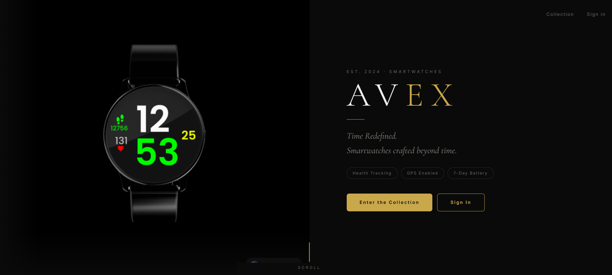
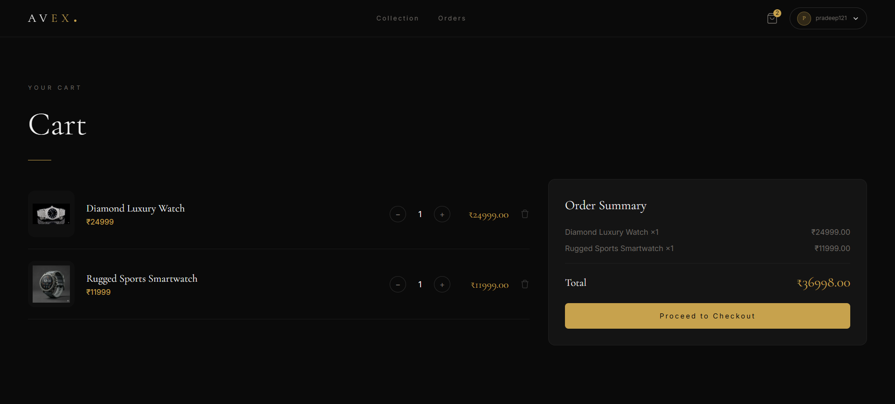
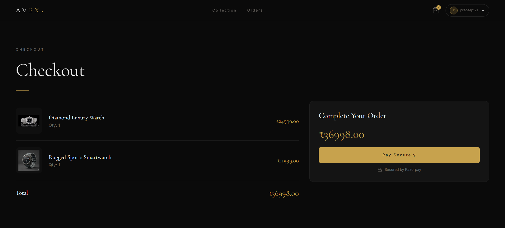
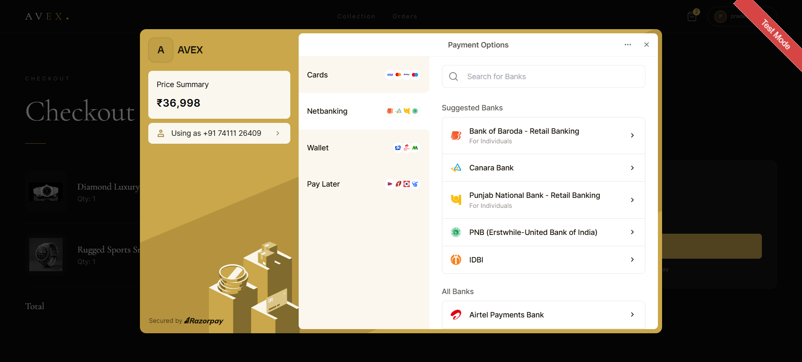

# AVEX WatchStore

A full-stack e-commerce application for smartwatches with an intuitive user interface, secure payment integration, and comprehensive product management.

## 📋 Project Overview

AVEX WatchStore is a modern e-commerce platform built with:

- **Backend**: Spring Boot 4.0.5 with Java 25, JPA/Hibernate, MySQL database
- **Frontend**: React 18+ with TypeScript, Vite, Tailwind CSS, Shadcn UI components
- **Payment Integration**: Razorpay for secure transactions
- **Authentication**: JWT-based authentication with email verification

## 🏗️ Project Structure

```
AVEX_WatchStore/
├── AVEX_WatchStore_backend/       # Spring Boot REST API
│   ├── src/
│   │   ├── main/
│   │   │   ├── java/              # Controllers, Services, Repositories
│   │   │   └── resources/         # Configuration, static files
│   │   └── test/                  # Unit tests
│   └── pom.xml                    # Maven dependencies
│
└── AVEX_WatchStore_frontend/      # React Vite application
    ├── src/
    │   ├── components/            # Reusable React components
    │   ├── pages/                 # Page components
    │   ├── hooks/                 # Custom React hooks
    │   ├── api/                   # API integration (Axios)
    │   └── lib/                   # Utility functions
    ├── package.json               # NPM dependencies
    └── vite.config.ts             # Vite configuration
```

## 🚀 Getting Started

### Prerequisites

**Backend:**

- Java 25 or higher
- Maven 3.6+
- MySQL 8.0+

**Frontend:**

- Node.js 18+ or Bun
- npm or bun package manager

### Backend Setup

1. Navigate to backend directory:

   ```bash
   cd AVEX_WatchStore_backend
   ```

2. Configure database credentials:

   ```bash
   cp src/main/resources/application.properties.example src/main/resources/application.properties
   ```

   Edit `application.properties` with your database credentials and API keys:

   ```properties
   spring.datasource.url=jdbc:mysql://localhost:3306/salessavvy
   spring.datasource.username=your_username
   spring.datasource.password=your_password
   jwt.secret=your_strong_secret_key
   RazorKey.ID=your_razorpay_key
   RazorKey.Secret=your_razorpay_secret
   spring.mail.username=your_email
   spring.mail.password=your_app_password
   ```

3. Build and run:
   ```bash
   mvn clean install
   mvn spring-boot:run
   ```

Backend runs on: `http://localhost:8080`

### Frontend Setup

1. Navigate to frontend directory:

   ```bash
   cd AVEX_WatchStore_frontend
   ```

2. Install dependencies:

   ```bash
   npm install
   # or
   bun install
   ```

3. Create environment configuration (optional):

   ```bash
   cp .env.example .env.local
   ```

4. Start development server:
   ```bash
   npm run dev
   # or
   bun run dev
   ```

Frontend runs on: `http://localhost:5173`

## � Database Setup

The project includes pre-configured SQL files for quick database setup.

### Quick Setup with SQL Files

The `DB dataWatchStore` folder contains all necessary SQL files:

**Available SQL Files:**

- `salessavvy_users.sql` - User accounts and authentication
- `salessavvy_categories.sql` - Product categories
- `salessavvy_products.sql` - Product catalog
- `salessavvy_productimages.sql` - Product images
- `salessavvy_cart_items.sql` - Shopping cart data
- `salessavvy_orders.sql` - Order management
- `salessavvy_order_items.sql` - Order line items
- `salessavvy_jwt_tokens.sql` - JWT token storage
- `salessavvy_otp_table.sql` - OTP verification

**Setup Steps:**

1. **Create database:**

   ```bash
   mysql -u root -p
   CREATE DATABASE salessavvy;
   EXIT;
   ```

2. **Import SQL files (choose one method):**

   **Method A - Command Line (Recommended):**

   ```bash
   cd DB\ dataWatchStore
   mysql -u root -p salessavvy < salessavvy_users.sql
   mysql -u root -p salessavvy < salessavvy_categories.sql
   mysql -u root -p salessavvy < salessavvy_products.sql
   mysql -u root -p salessavvy < salessavvy_productimages.sql
   mysql -u root -p salessavvy < salessavvy_cart_items.sql
   mysql -u root -p salessavvy < salessavvy_orders.sql
   mysql -u root -p salessavvy < salessavvy_order_items.sql
   mysql -u root -p salessavvy < salessavvy_jwt_tokens.sql
   mysql -u root -p salessavvy < salessavvy_otp_table.sql
   ```

   **Method B - MySQL Workbench:**
   - Open MySQL Workbench
   - Connect to MySQL server
   - Go to File → Run SQL Script
   - Select each `.sql` file from `DB dataWatchStore` folder
   - Execute

3. **Verify setup:**
   ```bash
   mysql -u root -p salessavvy
   SHOW TABLES;
   ```

For detailed database setup instructions, refer to [Backend Database Setup](./AVEX_WatchStore_backend/README.md#-database-setup)

## 📸 Screenshots

### Home Page - Hero Section



### Product Catalog


### Shopping Cart



### Checkout & Payment



### Razorpay Payment Gateway



## �📦 Features

### Backend Features

- ✅ User authentication with JWT
- ✅ Product catalog management
- ✅ Category-based filtering
- ✅ Shopping cart functionality
- ✅ Order management
- ✅ Payment processing via Razorpay
- ✅ Email notifications (Gmail SMTP)
- ✅ Product image management
- ✅ User role-based access control

### Frontend Features

- ✅ Responsive design (Mobile, Tablet, Desktop)
- ✅ Product browsing and search
- ✅ Shopping cart management
- ✅ Secure checkout flow
- ✅ User authentication (Login/Register)
- ✅ OTP verification
- ✅ Order history
- ✅ Modern UI with Shadcn components
- ✅ Toast notifications

## 🔒 Security & Sensitive Data

### Important: Protecting Sensitive Data

**Never commit sensitive files to version control!**

The following files are excluded via `.gitignore`:

- `application.properties` (backend)
- `.env` files (frontend)
- Node modules and build artifacts
- IDE and OS-specific files

### Example Configuration Files

1. **Backend**: Use `application.properties.example` as a template
2. **Frontend**: Create `.env.example` for environment variables

### Best Practices

- Generate strong JWT secrets: `openssl rand -base64 32`
- Use App-specific passwords for email (not your actual password)
- Keep Razorpay keys secured on backend only
- Never expose API keys in frontend code
- Use environment variables for all sensitive data

## 🎯 API Endpoints

### Products

- `GET /api/products` - Get all products (with optional category filter)
- `GET /api/products/{productId}` - Get product details

### Authentication

- `POST /api/auth/register` - Register new user
- `POST /api/auth/login` - User login
- `POST /api/auth/verify-otp` - Verify OTP

### Orders

- `GET /api/orders` - Get user orders
- `POST /api/orders` - Create new order

### Cart

- `GET /api/cart` - Get cart items
- `POST /api/cart` - Add item to cart
- `DELETE /api/cart/{itemId}` - Remove from cart

## 🛠️ Technology Stack

### Backend

- Spring Boot 4.0.5
- JPA/Hibernate
- MySQL
- Razorpay SDK
- JWT Authentication
- Spring Mail

### Frontend

- React 18+
- TypeScript
- Vite
- Tailwind CSS
- Shadcn UI Components
- Axios
- React Router
- React Hook Form
- Vitest (Testing)

## 📝 Development

### Building Backend

```bash
cd AVEX_WatchStore_backend
mvn clean install
mvn test
```

### Building Frontend

```bash
cd AVEX_WatchStore_frontend
npm run build
# or
bun run build
```

### Running Tests

```bash
# Backend
mvn test

# Frontend
npm run test
npm run test:watch
```

### Linting

```bash
cd AVEX_WatchStore_frontend
npm run lint
```

## 📂 Configuration Files

- `application.properties.example` - Backend configuration template
- `.gitignore` - Git ignore rules (prevents sensitive files from being committed)
- `pom.xml` - Maven dependencies (Backend)
- `package.json` - NPM dependencies (Frontend)
- `tailwind.config.ts` - Tailwind CSS configuration
- `vite.config.ts` - Vite build configuration
- `tsconfig.json` - TypeScript configuration

## 🤝 Contributing

1. Create a feature branch: `git checkout -b feature/your-feature`
2. Make your changes and commit: `git commit -m "feat: add your feature"`
3. Push to branch: `git push origin feature/your-feature`
4. Submit a pull request

## 📄 License

This project is proprietary and confidential.

## 👤 Author

**Vishal Dhavali**

## 📞 Support

For issues or questions, please contact the development team.

---

**⚠️ Important Security Note**: Before pushing to production:

- Review all API keys and credentials
- Configure database with proper security measures
- Enable HTTPS for frontend and backend
- Implement rate limiting
- Update CORS policies appropriately
- Review and update JWT expiration times
- Implement proper logging without exposing sensitive data
